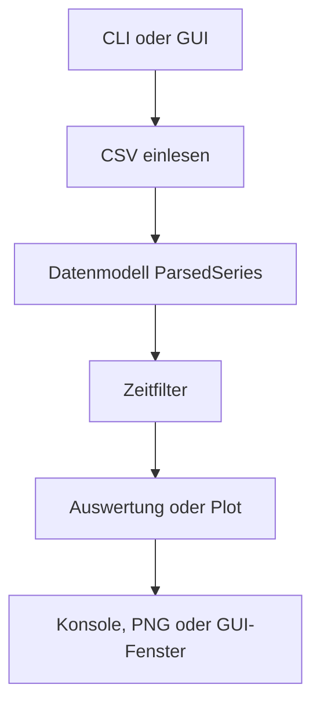
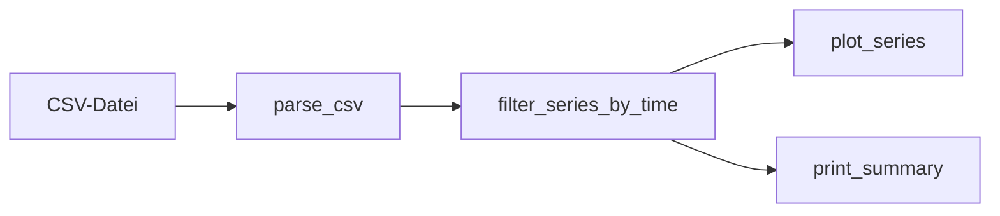
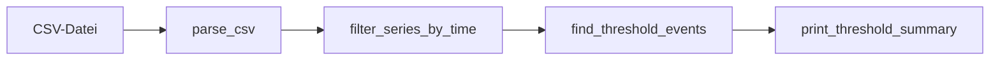
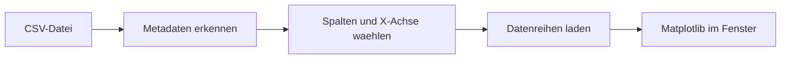

# Architektur

Dieses Dokument beschreibt den groben Systemaufbau und den Datenfluss des Projekts.

## Zielbild

Das Projekt besteht aus drei Einstiegspunkten:

- `main/log_analyzer.py` fuer Plot-Ausgabe als PNG im Terminal
- `main/peak_finder.py` fuer Schwellwertsuche im Terminal
- `main/csv_plotter.py` fuer eine interaktive Desktop-Oberflaeche

Die eigentliche Fachlogik liegt moeglichst gesammelt im Ordner `functions/`.
Dadurch bleiben die Einstiegspunkte schlank und die Wiederverwendung wird einfacher.

## Modulaufbau

## Verantwortlichkeiten

- `main/`: startet Programme und verbindet die einzelnen Verarbeitungsschritte
- `functions/csv_parser.py`: liest CSV-Dateien und baut daraus nutzbare Messreihen
- `functions/time_filters.py`: schraenkt Daten auf ein gewuenschtes Zeitfenster ein
- `functions/plotting.py`: erstellt PNG-Diagramme fuer die CLI-Nutzung
- `functions/thresholds.py`: erkennt Schwellwert-Uebergaenge
- `functions/reporting.py` und `functions/threshold_reporting.py`: erzeugen lesbare Konsolenausgaben
- `main/csv_plotter.py` plus `functions/csv_plotter_*`: stellen die interaktive GUI bereit

## Datenfluss

### CLI fuer Plot-Analyse

### CLI fuer Schwellwertsuche

### GUI fuer interaktives Plotten

## Strukturprinzip

- Gemeinsame Logik gehoert nach `functions/`, nicht mehrfach in einzelne Startdateien.
- Einstiegspunkte sollen moeglichst nur steuern, nicht selbst Fachlogik enthalten.
- Wenn einzelne Dateien zu gross werden, sollen neue Hilfsfunktionen in passende Module ausgelagert werden.
