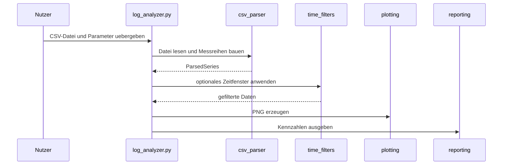
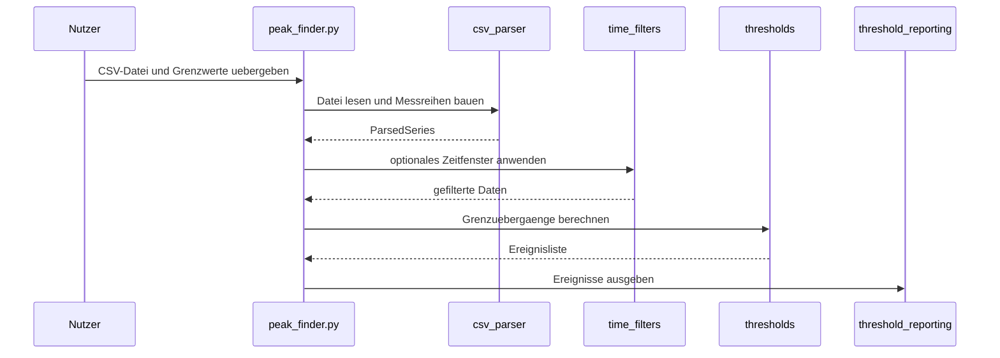

# CLI-Ablaufe

Dieses Dokument beschreibt die wichtigsten Arbeitsablaeufe der beiden Terminal-Programme.

## Plot-Analyse

## Schwellwertsuche

## Warum diese Trennung sinnvoll ist

- Parser, Filter und Auswertung koennen getrennt getestet und verstanden werden.
- Fehler in einem Schritt lassen sich schneller eingrenzen.
- Neue Ausgabekanaele koennen spaeter leichter ergaenzt werden.
